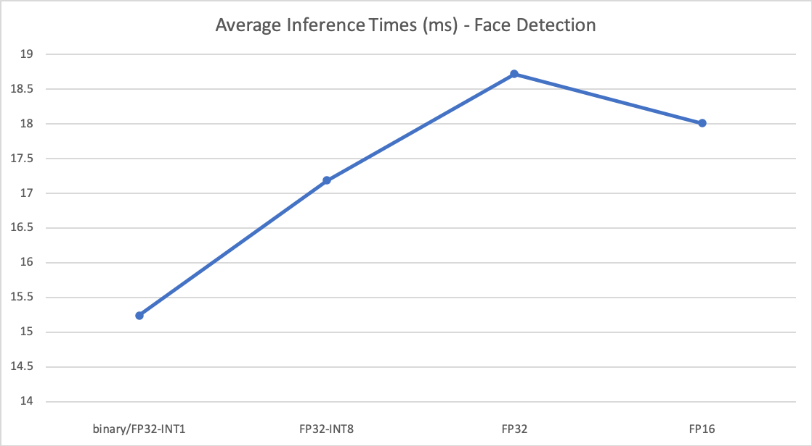

# Computer Pointer Controller

Implmentation of a computer pointer controller for the Intel Udacity Edge AI and IoT Nanodegree Program (ND131, Project 3).  This project utilizes four models from the Open Model Zoo to determine the direction of a person's gaze in a given input stream (Video or Camera input) and uses pyautogui library to move the mouse accordingly.

The four models used in this instance are:

- [Face Detection ADAS Binary 0001](https://docs.openvinotoolkit.org/latest/omz_models_intel_face_detection_adas_binary_0001_description_face_detection_adas_binary_0001.html)
- [Head Pose Estimation ADAS 0001](https://docs.openvinotoolkit.org/latest/omz_models_intel_head_pose_estimation_adas_0001_description_head_pose_estimation_adas_0001.html)
- [Facial Landmarks Regression Retail 0009](https://docs.openvinotoolkit.org/latest/omz_models_intel_landmarks_regression_retail_0009_description_landmarks_regression_retail_0009.html)
- [Gaze Estimation ADAS 0002](https://docs.openvinotoolkit.org/latest/omz_models_intel_gaze_estimation_adas_0002_description_gaze_estimation_adas_0002.html)

## Project Set Up and Installation

Running this project requires the [Intel OpenVino Toolkit](https://docs.openvinotoolkit.org) and supported platform.  For the purposes of testing development, a simple CPU device was used for benchmarking and assessment. Other python dependencies can be installed via pip in your local environment, although it is strongly recommended to use a virtual python environment.

```
pip3 install -r requirements.txt
```

Utilizing the model downloader tool that comes with OpenVino, you can download the aforementioned models using the download.sh script located in the bin directory.

```
./bin/download.sh

```

This will download all the models used in this project into the models subdirectory.

## Demo

The project uses the pipeline indicated in the project overview for getting to a gaze estimation.

Inference Pipeline:


In order to run the program, you will need all four models downloaded from the Open Model Zoo as described above
(downloadable via the ./bin/download.sh script, once you have the OpenVino Toolkit installed).

## Documentation

main.py has the following parameters:

- -i or --input (required) a local path to the input video file
- -it or --input_type (default to video) you can use cam to use your hardware's accessible video camera
- -v or --visualize (Yes | No) setting to Yes will overlay inference stats and visualization on the output video and preview
- -mf or --face_model (required) local path to the model to use for Face recognition
- -ml or --landmark_model (required) local path to the model to use for Facial Landmark recognition
- -mp or --pose_model (required) local path to the model to use for Head Pose recognition
- -mg or --gaze_model (required) local path to the model to use for Gaze Estimation
- -l or --cpu_extension (optional) Absolute path to a shared library with the kernel's implmentation
- -d or --device (required, default to CPU) Target device for OpenVino inference (one of CPU, GPU, FPGA or MYRIAD)
- -pt or --prob_threshold (float) Probability threshold for the face detection algorithm to use, defaults to 0.5 confidence
- -o or --output_path (required, defaults to ./output) Where to place aggregated inference stats once the program has completed

Example program run (using FP16 models):

```
python3 ./main.py  -i input/demo.mp4 -it video -mf models/intel/face-detection-adas-0001/FP16/face-detection-adas-0001 -mp models/intel/head-pose-estimation-adas-0001/FP16/head-pose-estimation-adas-0001 -ml models/intel/landmarks-regression-retail-0009/FP16/landmarks-regression-retail-0009 -mg models/intel/gaze-estimation-adas-0002/FP16/gaze-estimation-adas-0002 -d CPU -pt 0.6 -o output -v Yes
```

## Benchmarks
When [comparing benchmarks](./inference_comparison.csv) for different types of models, I found the head pose, facial landmarks and gaze estimation inferences were always well under 2ms each no matter what precision was in use (at least on a modern Intel QuadCore i7 CPU), so I decided to focus on optimizing performance of different Face Recognition models.  The model with the best performance turned out to be the [Face Detection ADAS Binary 0001](https://docs.openvinotoolkit.org/latest/omz_models_intel_face_detection_adas_binary_0001_description_face_detection_adas_binary_0001.html)

Performance of different face detection models and precisions:


## Results
Utilizing the comparison, I was able to settle on an inference pipeline that was able to complete the four required inferences on a CPU device in an average of .019 seconds or 19ms, resulting in a pipeline that could more than keep up with the 30fps input demo video provided.  However, the main bottleneck was in the moving of the mouse pointer as it was also done on the same thread as processing each inference.  To compensate, I only updated the mouse position once for every three frames processed (10fps).  Adding an additional scale factor to decrease the distance move of each mouse move call also helped (a factor of 1/4 was used to quarter each distance).

For the code for visualizing the gaze estimation, as well as other inference outputs, I relied heavily on both the python and C++ demo code contained in the OpenVino Toolkit, specifically, the [Gaze Estimation Demo](https://docs.openvinotoolkit.org/latest/omz_demos_gaze_estimation_demo_README.html).  I also reused alot of the main pipeline code from Project 01 of this course in order to build the main run loop and inference classes.

## Stand Out Suggestions
I abstracted each visualization (one for each model) into their own function to make the main pipeline code in main.py easy to understand. Additionally, these visualizes can be globally turned off by passing the -v flag of "No" when running the program.

### Edge Cases
With the demo video, I noticed that one edge case was then the instructor moved his head back to his initial pose, as it wasn't a dead center pose to the camera, the inference still calculated a non-zero pose and thus kept moving the mouse.  A further enhancement would compute a delta compared to the very first initial head pose (or maybe a running difference?) so that mouse movement would stop when a head pose returned to the original pose/gaze.
